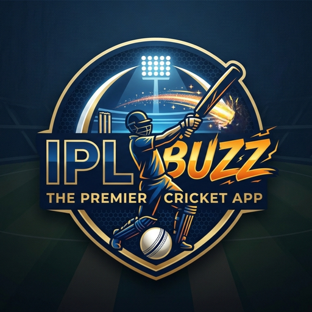

<div align="center">



# IPLBuzz — The World of T20 Cricket

**A complete, offline-first IPL analytics dashboard.** Scores, full scorecards, ball-by-ball charts, stats leaderboards, team profiles and an in-app analyst — in a single static web app with zero dependencies.

[**🌐 Open the live app**](https://prashobhpaul.github.io/IPLBuzz/) · [**⬇️ Download**](#-download--install)

</div>

---

## 🏆 IPL 2026 at a glance

| | |
|---|---|
| **Champions** | Royal Challengers Bengaluru (beat Gujarat Titans in the Final) |
| **Runners-up** | Gujarat Titans |
| **Orange Cap** | Vaibhav Sooryavanshi — 776 runs |
| **Purple Cap** | Bhuvneshwar Kumar — 29 wickets |

---

## ⬇️ Download & Install

**Install as an app (recommended — works fully offline):**
- **Mobile (Android/iOS):** open the [live app](https://prashobhpaul.github.io/IPLBuzz/), then **Add to Home Screen**.
- **Desktop (Chrome/Edge):** open the [live app](https://prashobhpaul.github.io/IPLBuzz/) and click the **Install** icon in the address bar.

It's a full **PWA** — once installed it launches like a native app and keeps working with no network.

**Download the source / self-host:**
- **[⬇️ Download ZIP](https://github.com/PrashobhPaul/IPLBuzz/archive/refs/heads/main.zip)**
- or clone: `git clone https://github.com/PrashobhPaul/IPLBuzz.git`

Then serve the folder over any static server (the app fetches CSV data, so it needs `http://`, not `file://`):

```bash
cd IPLBuzz
python3 -m http.server 8000
# open http://localhost:8000
```

---

## Features

- **Home** — champions banner, final standings (with playoff cut-off) and season awards
- **Matches** — every match with detailed scorecards and analytics
- **Match Analytics** — Scorecard · animated **Worm Chart** · **Over Analysis** · Partnerships · Player Analysis · Key Moments, all derived from ball-by-ball data
- **Tournament Stats** — 16 full-season leaderboards (Orange Cap, Purple Cap, and more)
- **Teams** — for each side: crest, intro, key performers, where they finished, and the full 2026 squad (coach & captain first)
- **🏏 IPLBuzz Bot** — an in-app analyst that answers from the season data (works offline; upgrades to a hosted LLM when configured)

Premium, animated UI that adapts to mobile, tablet and desktop.

## Data model

All data lives in CSV files loaded at startup (no backend required):

| File | What |
|---|---|
| `Schedule.csv` | All 74 matches — teams, venue, result, scores, POM, toss, playoff stage |
| `Points.csv` | Final league points table (P/W/L/NR/Pts/NRR) |
| `Batting.csv` · `Bowling.csv` | Per-innings batting & bowling scorecards |
| `FOW.csv` · `Partnerships.csv` | Fall of wickets and partnerships per innings |
| `Overs.csv` | Over-by-over runs/wickets (worm chart & over analysis) |
| `Teams.csv` · `Squads.csv` | Team metadata (captain/coach) and full squads |

Match data is sourced from **[Cricsheet](https://cricsheet.org)** ball-by-ball records (ODbL). All leaderboards, the points table and analytics are computed in-browser, so every number reconciles with the scorecards.

## 🔁 Built to be reused every season

The app is a **platform**, not a one-off. Everything season-specific is in one `CONFIG` block at the top of `index.html`:

- Point `CONFIG.data.*` at next season's CSVs and bump `CONFIG.season` — the whole app adapts with **zero code changes**.
- `CONFIG.live` re-enables live scores: `worker.js` (a Cloudflare Worker) polls CricAPI into Firebase and the app reads `iplbuzz/live`. `admin.html` ingests fresh CSVs.
- `CONFIG.chat.apiKey` switches the analyst from the built-in offline engine to a hosted LLM.

So next year: drop in new data (or flip on live mode), and IPLBuzz is ready for the new IPL season.

## Tech

Single-file app (`index.html`) + CSV data + a Service Worker (`sw.js`) for instant, offline-first loads. Static-host friendly (GitHub Pages / Cloudflare Pages / Netlify). No build step.

---

<div align="center"><sub>Match data © <a href="https://cricsheet.org">Cricsheet</a> (ODbL). Team logos are property of their respective franchises.</sub></div>
